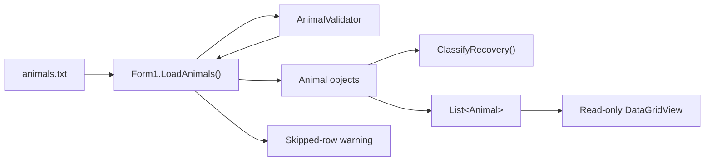

<div align="center">

# Baobab Ridge Wildlife Rehabilitation Records System


A Windows desktop application for managing animal rehabilitation records at Baobab Ridge. The system validates animal information, classifies recovery progress, loads stored records safely, and presents valid records in an accessible interface.

[Repository](https://github.com/harriperSoda/PRG271-Baobab-Ridge)

</div>

## Features

### Currently implemented

- Load animal records from `animals.txt`.
- Create the data file automatically when it does not exist.
- Validate animal IDs, names, species, ages, and recovery scores.
- Require animal IDs to follow the `WR-####` format.
- Automatically classify animals according to their recovery score.
- Assign the appropriate status and housing unit.
- Skip malformed or inconsistent file rows without stopping the application.
- Display row-specific explanations when records are skipped.
- Display valid animals in their original file order.
- Prevent direct editing through the read-only `DataGridView`.

### In development

- Add new animal records — **TBD**
- Remaining record-management features — **TBD**
- Final user-interface design — **TBD**

## Recovery Classification

| Recovery score | Status | Housing unit |
|---:|---|---|
| 0–19 | Critical | Intensive Care Unit |
| 20–39 | Serious | High-Dependency Ward |
| 40–59 | Stable | Recovery Ward |
| 60–79 | Recovering | Outdoor Enclosure |
| 80–100 | Release-Ready | Pre-Release Camp |

## Tech Stack

- **C#** — implements the application logic, animal model, validation, and recovery classification.
- **.NET 8** — provides the application runtime and framework.
- **Windows Forms** — provides the Windows desktop interface.
- **DataGridView** — displays animal records in a read-only table.
- **Text-file storage** — stores animal records in `animals.txt` using pipe-separated fields.
- **Git and GitHub** — provide version control, feature branching, pull requests, and team collaboration.

The application currently has no external packages, database, web service, or environment-variable requirements.

## Architecture



### Application flow

1. The Windows Form starts and calls `LoadAnimals()`.
2. The application locates `animals.txt` in the application folder.
3. Each row is split into its seven expected fields.
4. `AnimalValidator` validates the stored values.
5. Valid values are used to construct an `Animal`.
6. The constructor calculates the animal’s status and housing unit.
7. The calculated classification is compared with the values stored in the file.
8. Valid animals are added to the list and displayed in the grid.
9. Malformed rows are skipped and reported to the user.

## Project Structure

```text
PRG271-Baobab-Ridge/
├── README.md
├── .gitignore
└── PRG271-Baobab-Ridge/
    ├── Animal.cs
    ├── AnimalValidator.cs
    ├── Form1.cs
    ├── Form1.Designer.cs
    ├── Form1.resx
    ├── Program.cs
    ├── animals.txt
    ├── PRG271-Baobab-Ridge.csproj
    └── PRG271-Baobab-Ridge.slnx
```

| File | Responsibility |
|---|---|
| `Animal.cs` | Defines animal properties and recovery-classification logic. |
| `AnimalValidator.cs` | Provides reusable validation methods and error messages. |
| `Form1.cs` | Loads, validates, and displays animal records. |
| `Form1.Designer.cs` | Defines the Windows Forms controls and layout. |
| `Program.cs` | Starts the application. |
| `animals.txt` | Stores pipe-separated animal records. |
| `PRG271-Baobab-Ridge.csproj` | Defines the .NET project configuration and includes the data file. |
| `PRG271-Baobab-Ridge.slnx` | Visual Studio solution file. |

## Installation and Setup

### Prerequisites

- Windows 10 or later
- [Visual Studio 2022](https://visualstudio.microsoft.com/vs/)
- The **.NET desktop development** workload
- [.NET 8 SDK](https://dotnet.microsoft.com/download/dotnet/8.0)
- Git

No database or environment-variable configuration is currently required.

### Clone the repository

```powershell
git clone https://github.com/harriperSoda/PRG271-Baobab-Ridge.git
cd PRG271-Baobab-Ridge
```

### Run with Visual Studio

1. Open `PRG271-Baobab-Ridge/PRG271-Baobab-Ridge.slnx`.
2. Allow Visual Studio to restore the project.
3. Build the solution.
4. Press `F5` or select **Start**.

### Run from the command line

```powershell
dotnet build .\PRG271-Baobab-Ridge\PRG271-Baobab-Ridge.csproj
dotnet run --project .\PRG271-Baobab-Ridge\PRG271-Baobab-Ridge.csproj
```

The project copies `animals.txt` into the application output folder. If the file is missing at runtime, the application creates an empty one.

## Usage

1. Start the application.
2. The application automatically reads `animals.txt`.
3. Valid animal records appear in the read-only grid.
4. If malformed records are found, the application displays:
   - The number of successfully loaded animals
   - The number of skipped rows
   - The row number and reason for each skipped record
5. Review the displayed animal details, recovery status, and assigned housing unit.

Each file row uses the following format:

```text
AnimalId|Name|Species|Age|RecoveryScore|Status|HousingUnit
```

Example:

```text
WR-0001|Thabo|African Penguin|4|85|Release-Ready|Pre-Release Camp
```

## Screenshots

**TBD:** Add screenshots after the final interface has been completed.

A suggested location is:

```text
docs/images/animal-grid.png
```

The screenshot can then be added with:

```markdown

```

## Engineering Decisions

### Centralised validation

Animal validation is contained in `AnimalValidator` so that loading, adding, and updating animals can use the same rules and error messages.

### Derived classification

Status and housing unit are calculated from the recovery score instead of being manually supplied to the `Animal` constructor. This reduces the chance of inconsistent classifications.

### File consistency checking

The loader recalculates each animal’s classification and compares it with the status and housing unit stored in the file. Inconsistent rows are skipped instead of displaying incorrect information.

### Resilient file loading

One malformed row does not prevent the rest of the file from loading. Each invalid row is skipped, recorded, and reported to the user.

### Flat-file storage

A text file keeps the project simple and meets its current requirements. The trade-off is that it does not provide database features such as concurrent access, transactions, or complex queries.

### Read-only record display

The grid is read-only so records cannot be changed without passing through the application’s validation and file-saving process.

## Testing

The project currently uses manual testing.

Tests completed include:

- Building the solution successfully.
- Loading valid animal records.
- Preserving the order of records from the file.
- Displaying records in the read-only grid.
- Skipping malformed rows.
- Reporting invalid animal IDs with a row-specific error.
- Checking calculated classification against stored classification.

To verify the project builds:

```powershell
dotnet build .\PRG271-Baobab-Ridge\PRG271-Baobab-Ridge.csproj
```

Automated unit tests are **TBD**.

## Limitations and Future Improvements

- Animal creation and the remaining management features are still being developed.
- The application currently uses a text file rather than a database.
- The file-loading logic currently resides inside `Form1` and could later be moved into a separate repository or service class.
- The `Animal` constructor relies on callers to validate the recovery score before creating the object.
- Automated tests have not yet been added.
- The application currently supports Windows only.
- The final interface design and screenshots are **TBD**.
